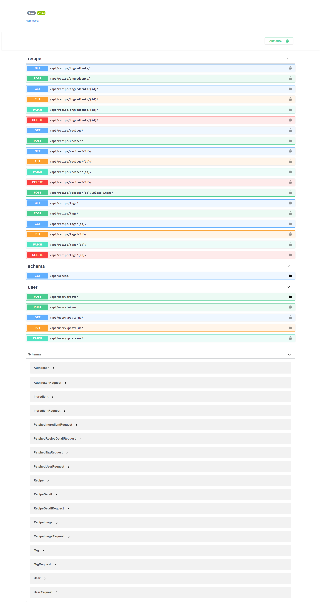

# Flavorfinder

A Django intermediate REST API project that utilizes Test Driven Development practices and the following technologies:
- Django framework
- Docker for setting up the project
- GitHub Actions for linting and testing
- Django REST framework
- Postgres database
- Swagger UI for API documentation

This was part of [udemy course](https://www.udemy.com/course/django-python-advanced/)
## Purpose
This project provides a functioning API for creating and managing users, tags, ingredients, and recipes. It also allows for filtering and uploading images through the API.

## Getting Started
1. Make sure you have [Docker](https://www.docker.com/) and [Docker Compose](https://docs.docker.com/compose/) installed on your machine.
2. Clone the repository
3. Navigate to the project directory: `cd flavorfinder`
4. Build the Docker containers: `docker-compose build`
5. Run the Docker containers: `docker-compose up`
6. The API will be running at `http://localhost:8000`
7. You can access the Swagger UI for API documentation at `http://localhost:8000/docs/`

## Running Tests
1. Make sure the Docker containers are running (`docker-compose up`)
2. Run the tests: `docker-compose run --rm app sh -c "python manage.py test"    `

## Linting
Linting is done automatically on every push and pull request using GitHub Actions. You can also lint the code locally 

## Technologies used
- [Django](https://www.djangoproject.com/) - The web framework used
- [Django REST framework](https://www.django-rest-framework.org/) - Used for creating the REST API
- [Docker](https://www.docker.com/) - Used for setting up the project
- [Postgres](https://www.postgresql.org/) - Used as the database
- [Swagger UI](https://swagger.io/tools/swagger-ui/) - Used for API documentation

